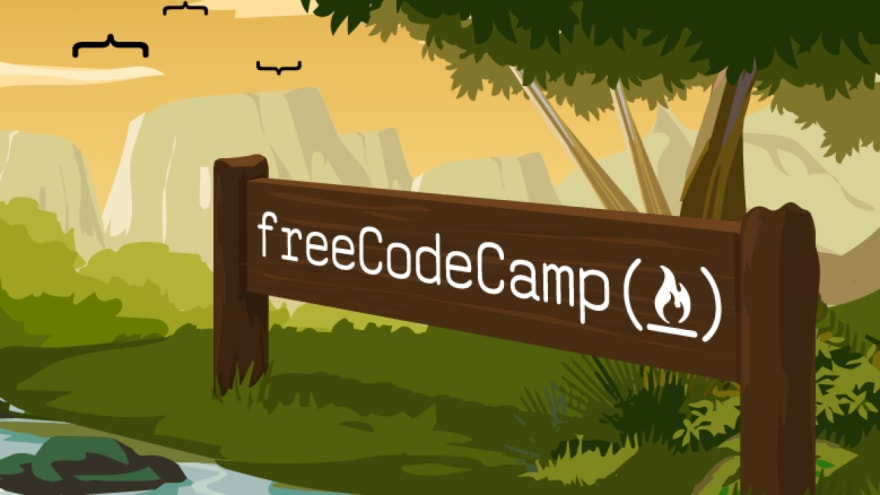
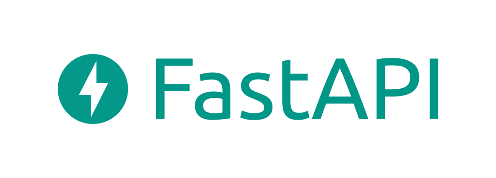
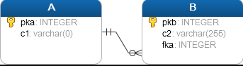
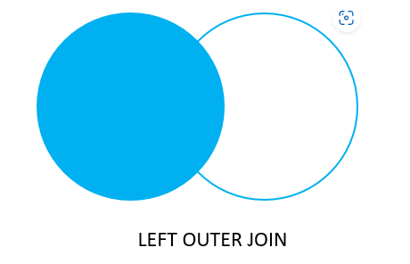

# FastAPI

[](https://www.freecodecamp.org/)



Link for more information about [FastAPI](https://fastapi.tiangolo.com/) or [python](https://www.python.org/).
- Python API Development - Comprehensive Course for Beginners

A restful crud api with python using fastapi framework.
[SWAGGER](http://127.0.0.1:8000/docs#/) docs.

### About Swagger

- Swagger is a powerful yet easy-to-use suite of API developer tools for teams and individuals, enabling development across the entire API lifecycle, from design and documentation, to test and deployment.

- Swagger consists of a mix of open source, free and commercially available tools that allow anyone, from technical engineers to street smart product managers to build amazing APIs that everyone loves.

- Swagger is built by SmartBear Software, the leader in software quality tools for teams. SmartBear is behind some of the biggest names in the software space, including Swagger, SoapUI and QAComplete.


## The History Behind Swagger

- Swagger started out as a simple, open source specification for designing RESTful APIs in 2010. Open source tooling like the Swagger UI, Swagger Editor and the Swagger Codegen were also developed to better implement and visualize APIs defined in the specification. The Swagger project, consisting of the specification and the open source tools, became immensely popular, creating a massive ecosystem of community driven tools.

- In 2015, the Swagger project was acquired by SmartBear Software. The Swagger Specification was donated to the Linux foundation and renamed the OpenAPI

- Specification to formally standardize the way REST APIs are described. The OpenAPI Initiative was created to guide the development of the OAS in an open and transparent manner.

- Swagger has since become the most popular suite of tools to fully leverage the power of the OAS across the API lifecycle.


### CRUD
- GET     endpoint ('/')
- POST    endpoint ("/posts")
- DELETE  endpoint ('/posts/{id}')
- PUT     endpoint ('/posts/{id}')


## database

- PostgresSQL

Psycopg: Drive for postgres database

```sql
-- Run this command with the following options:

docker run --name postgres-py -p 5432:5432 -e POSTGRES_PASSWORD=postgres -d postgres
```
- docker run: Run the Docker
- --name postgres-py: Name of the container
- -p 5432:5432: This is the port that will be used to connect to the postgres server.
- -e POSTGRES_PASSWORD=postgres: Create a password for the postgres server.
- -d postgres: The postgres server will connect.

### JOIN

- PostgreSQL LEFT JOIN

ntroduction to PostgreSQL LEFT JOIN clause
Suppose that you have two tables: A and B.



A and B tables
Each row in the table A may have zero or many corresponding rows in the table B while each row in the table B has one and only one corresponding row in the table A .

To select data from the table A that may or may not have corresponding rows in the table B , you use the LEFT JOIN clause.

The following statement illustrates the LEFT JOIN syntax that joins the table A with the table B :

```sql
SELECT
	pka,
	c1,
	pkb,
	c2
FROM
	A
LEFT JOIN B ON pka = fka;
```
To join the table A with the table B table using a left join, you follow these steps:

First, specify the columns in both tables from which you want to select data in the SELECT clause.
Second, specify the left table (table A) in the FROM clause.
Third, specify the right table (table B) in the LEFT JOIN clause and the join condition after the ON keyword.
The LEFT JOIN clause starts selecting data from the left table. For each row in the left table, it compares the value in the pka column with the value of each row in the fka column in the right table.

If these values are equal, the left join clause creates a new row that contains columns that appear in the SELECT clause and adds this row to the result set.

In case these values are not equal, the left join clause also creates a new row that contains columns that appear in the SELECT clause. In addition, it fills the columns that come from the right table with NULL.

The following Venn diagram illustrates how the LEFT JOIN clause works:



Note that the LEFT JOIN is also referred to as LEFT OUTER JOIN.

PostgreSQL LEFT JOIN examples
Let’s look at the following film and inventory tables from the sample database.


Each row in the film table may have zero or many rows in the inventorytable. Each row in the inventory table has one and only one row in the film table.

The film_id column establishes the link between the film and inventory tables.

The following statement uses the LEFT JOIN clause to join film table with the inventorytable:

```sql
SELECT
	film.film_id,
	title,
	inventory_id
FROM
	film
LEFT JOIN inventory 
    ON inventory.film_id = film.film_id
ORDER BY title;
```

### ORM sqlachemy

- The Python SQL Toolkit and Object Relational Mapper
  
SQLAlchemy is the Python SQL toolkit and Object Relational Mapper that gives application developers the full power and flexibility of SQL.

It provides a full suite of well known enterprise-level persistence patterns, designed for efficient and high-performing database access, adapted into a simple and Pythonic domain language.


### Passlib and Bcrypt

- Hashing the password using passlib to cryptographically 


### JSON Web Tokens

- Or JWT. What is JSON Web Token?
  
JSON Web Token (JWT) is an open standard (RFC 7519) that defines a compact and self-contained way for securely transmitting information between parties as a JSON object. This information can be verified and trusted because it is digitally signed. JWTs can be signed using a secret (with the HMAC algorithm) or a public/private key pair using RSA or ECDSA.

Although JWTs can be encrypted to also provide secrecy between parties, we will focus on signed tokens. Signed tokens can verify the integrity of the claims contained within it, while encrypted tokens hide those claims from other parties. When tokens are signed using public/private key pairs, the signature also certifies that only the party holding the private key is the one that signed it.

### Bcrypt

- Acceptable password hashing for your software and your servers (but you should really use argon2id or scrypt)

```bash
$ pip install bcrypt
```

### pydantic

Data validation and settings management using Python type hints.

Fast and extensible, pydantic plays nicely with your linters/IDE/brain. Define how data should be in pure, canonical Python 3.7+; validate it with pydantic.

Help
See documentation for more details.

Installation
Install using pip install -U pydantic or conda install pydantic -c conda-forge. For more installation options to make pydantic even faster, see the Install section in the documentation.

A Simple Example

```py
from datetime import datetime
from typing import List, Optional
from pydantic import BaseModel

class User(BaseModel):
    id: int
    name = 'John Doe'
    signup_ts: Optional[datetime] = None
    friends: List[int] = []

external_data = {'id': '123', 'signup_ts': '2017-06-01 12:22', 'friends': [1, '2', b'3']}
user = User(**external_data)
print(user)
#> User id=123 name='John Doe' signup_ts=datetime.datetime(2017, 6, 1, 12, 22) friends=[1, 2, 3]
print(user.id)
#> 123
```

### .env File

- The .env file format is central to good DSX and has been since it was introduced by Heroku in 2012 and popularized by our dotenv node module (and other libraries) in 2013.

The .env file format starts where the developer starts - in development. It is added to each project but NOT committed to source control. This gives the developer a single secure place to store sensitive application secrets.

Can you believe that prior to introducing the .env file, almost all developers stored their secrets as hardcoded strings in source control. That was only 10 years ago!

Example
Here’s an example of what a .env file looks like:

### example 

```.env
STRIPE_API_KEY=scr_12345
TWILIO_API_KEY=abcd1234
```

It is purposefully simple because, as security professionals, we know that complexity is the enemy of security.

You can read more about how it works here (or at other implementations here, here, here). It is the gold standard for securing development secrets - proven and trusted by millions of developers around the world.

But the world has changed and developers manage secrets at far greater scale than a decade ago. Today it’s difficult to securely share .env files between machines, environments, and team members. As a result, developers often share secrets over Slack, email, text message, and post-it notes. It’s not scaleable and fraught with security risks. For a CTO or CSO it is a risk they should not take.

### Extending .env

Luckily, that is changing. We have been extending the .env file format to support secure sharing.

The .env file format will still be at the center of security. But we have added two new extensions. They are not required. They are optional, but we highly recommend them for teams. They are the:

.env.vault extension
.env.me extension
In the next set of security docs you can read about how these work alongside your .env files to significantly improve security. This is the next great leap forward in application secrets security, and like the original .env file format we have worked hard to minimize complexity in order to increase security.


## Limbic

Lexicon-based Emotion analysis from text tool for series/movie subtitles, books, etc.

Introduction
The objective of this package is simple: If you need to compute some emotion analysis on a word or a set of words this should be able to help. For now, it only supports plain text and subtitles, but the idea is to extend it to other formats (pdf, email, among other formats). In the meantime, this includes a basic example on how to use it on plain text and another example on how to use it in a collection of subtitles for series (all episodes for all seasons of a show). The name of the package is based on the limbic system, which is a set of brain structures that support different functions, like emotions or behavior among others.

There are two strategies to compute the emotions from text supported right now:

- Via lexicon-based word matching, which is quite straightforward and examples of its usage are described below.
- 
- Via a multi-label machine learning classifier trained with the specific purpose of identifying emotions and their 
strength in full sentences.

Limbic also has a set of tools that are easy to reuse and extend for different use cases. For example, contains tools for the analysis of subtitles in a show, but can be easily extended to analyze books, papers, websites, customer reviews, or even further applications like comparing a movie script with its book, comparing properties of movies in a sequel, among others.

More advanced strategies will be added as I can assess the performance and correctly setup an experimental framework that anyone can replicate. These will be considered as future work. However, if you have some ideas or want to contribute, please do! Just let me know how can I help :)

It's important to note that if you are using the NRC or other proprietary lexicons, you should read and follow their terms of use. Otherwise, if you are using this package with your lexicons, you can use it however you want following the MIT license.